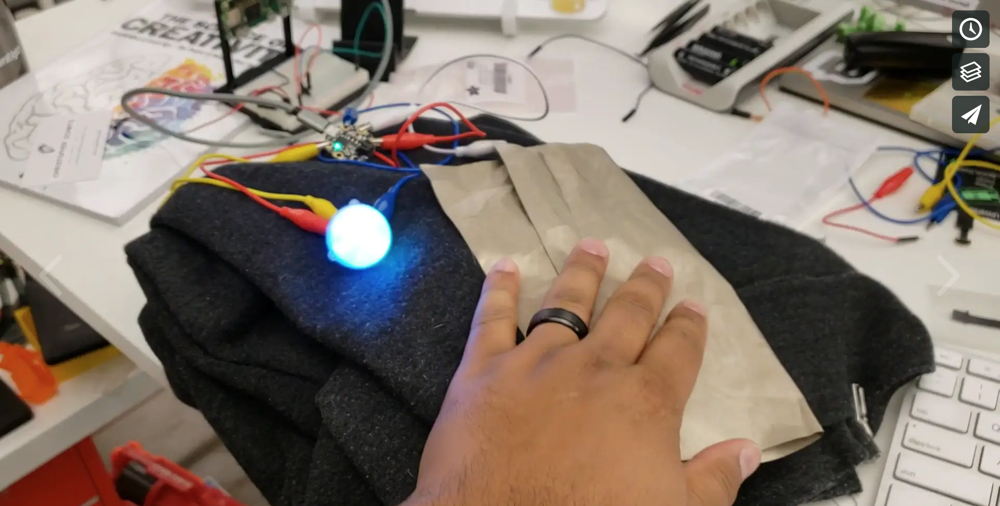
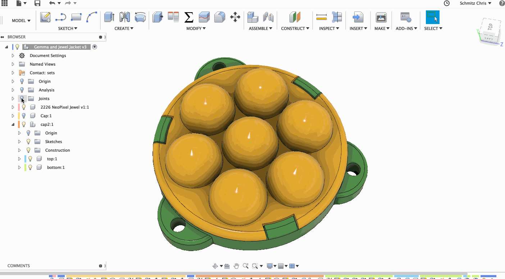

# Gemma Jacket

For christmas this year I'm making a jacket for my daughter. The plan is for the jacket to have an adafruit jewel on the chest and conductive fabric in the pockets of the jacket. When she puts her hands into her pockets the jewel will animate with a light pattern. Super simple, but a lot of new stuff to me.

### MVP for code and electronics

### 3D modeling the case for the jewel

### Some progress videos:

- [MVP](https://vimeo.com/299450215)
- [Jewel Case Tests](https://vimeo.com/300294198)

## The shopping list

This project is still in progress (as of 2018-11-12), but so far the parts list is:

- [Adafruit Gemma M0](https://www.adafruit.com/product/3501)
- [Adafruit Jewel](https://www.adafruit.com/product/2226)
- [Woven conductive fabric](https://www.adafruit.com/product/1168)
- [3 AAA battery holder](https://www.adafruit.com/product/727)
- [Silicon covered stranded wire](https://www.adafruit.com/product/2003)

## The code

The code is written in circuit python and is pretty simple. It will evolve as I work towrads the end of the project, but probably not by much. The portion that seems to be in flux the most is the capacitive touch settings.

## The STLs

The STLs needed to print the jewel case can be found in this repository or [here on thingiverse](https://www.thingiverse.com/thing:3209885).
